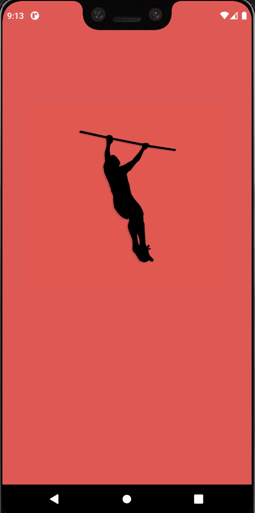

# Calisthenics Workout App
MVP for a fitness app created using react-native which can be scaled and extended as per the product requirements. 

## Run
    - yarn install
    - yarn run ios/android

## Release
    - Update android/build.gradle 
        compileSdkVersion = 29 -> 30
        targetSdkVersion = 29 -> 30

    - Increase both the values by 1 in android/app/android
        versionCode 1
        versionName "1.0"

    - yarn android-release

## Motivation
I wanted to help fitness industry to come up with great apps whether it is related to physical or mental. Anyone can use the repo and scale up to the required needs. 

## Help
- I have been working on this app on and off. 
- May be my code haven't been up not to the mark or missed some obvious cases as I had very less time. 
- Due to the lack of time I am looking for community help to improve the project. 

## Improvements
- Categories
    - Implement dropdown list

- Correct user-name

- Screen responsive testing
- Add sound (after exercise and routine is completed)

## Issues
- Home - Exit app at backhandler
- 

## Contribution
I am not following any specific pattern for PR, just follow the basics. 